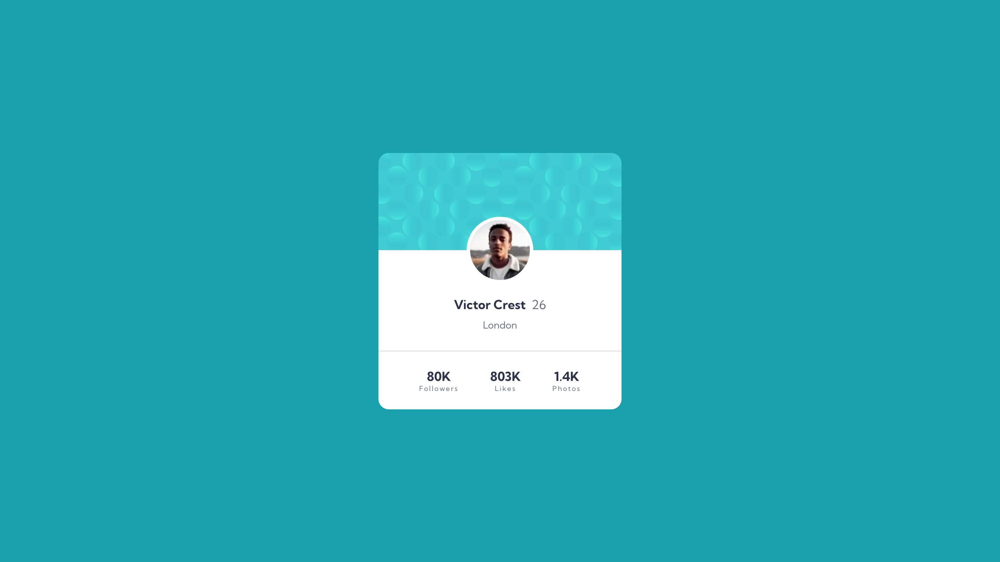
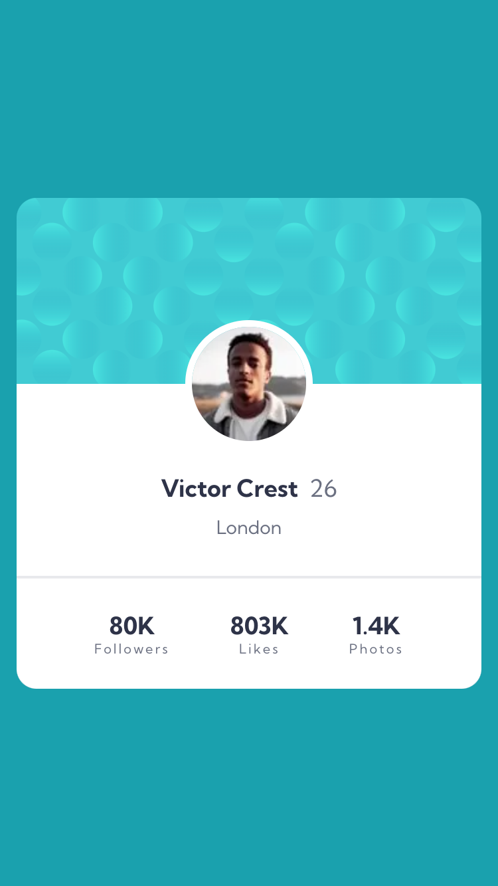

# Frontend Mentor - Profile card component solution

This is a solution to the [Profile card component challenge on Frontend Mentor](https://www.frontendmentor.io/challenges/profile-card-component-cfArpWshJ). Frontend Mentor challenges help you improve your coding skills by building realistic projects.

## Table of contents

- [Overview](#overview)
  - [The challenge](#the-challenge)
  - [Screenshot](#screenshot)
- [My process](#my-process)
  - [Built with](#built-with)
  - [Useful resources](#useful-resources)
- [Author](#author)

## Overview

### The challenge

- Build out the project to the designs provided

### Screenshot

## My process

### Built with

- Semantic HTML5 markup
- CSS custom properties
- Flexbox
- Mobile-first workflow
- [React](https://reactjs.org/) - JS library
- [Next.js](https://nextjs.org/) - React framework
- [Sass](https://sass-lang.com/) - For styles
- [TypeScript](https://www.typescriptlang.org/)
- [ESLint](https://eslint.org/)

### Useful resources

- [Next.js Docs](https://nextjs.org/docs)

## Author

- LinkedIn - [Rex Leonardo](https://www.linkedin.com/in/rex-leonardo-2a521b16a)
- Frontend Mentor - [@rexleonardo](https://www.frontendmentor.io/profile/rexleonardo)
